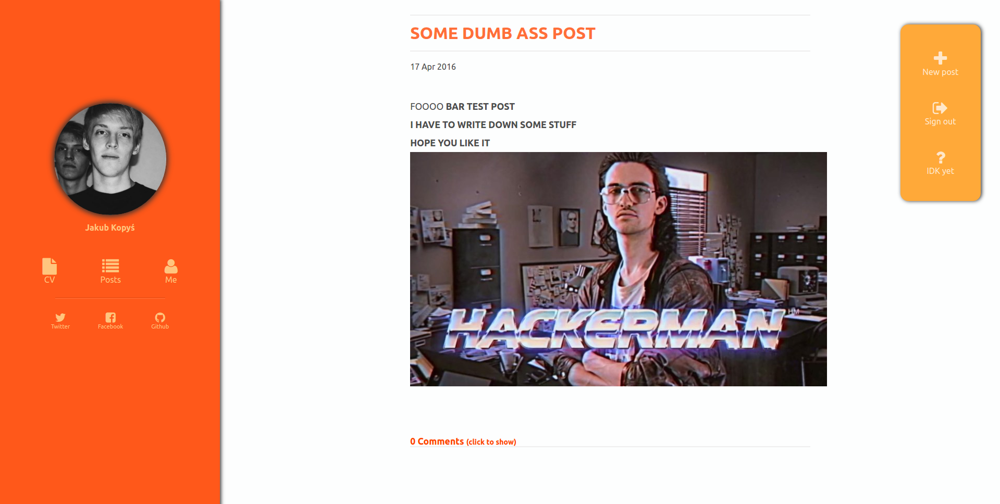

# myblog
It is my blog web app.
It enables admin (that can login by visiting /login) to add posts etc.
Visitors have possibility to comment on posts.
You can try it here: https://mighty-tundra-15432.herokuapp.com/

